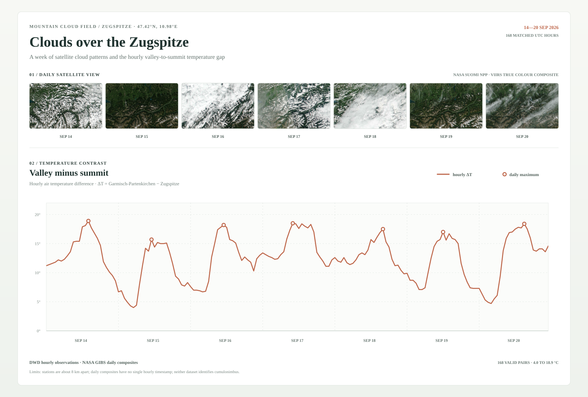

# Clouds over the Zugspitze

**[Explore the interactive version →](#interactive-field-story)** · English / 中文 · Scroll through the satellite week, play hourly temperatures, and explore cloud-height scans.



**Finding · 14–20 September 2026:** The valley was warmer than the summit in all 168 observed hours: the hourly temperature gap ranged from **4.0 to 18.9 °C**, and daily peaks ranged from **15.7 to 18.9 °C**.

## The phenomenon

Clouds continually form and change over the Alps as air rises across steep terrain. This project looks at the Zugspitze region in southern Germany and asks how the hourly air-temperature difference between a nearby valley station and the mountain summit changed during 14–20 September 2026. Satellite images provide a visual record of cloud patterns over the same seven days. The temperature contrast is a prompt for exploration, not a proxy for thunderstorms.

## The source

The two original hourly station archives are published by the [Deutscher Wetterdienst (DWD)](https://opendata.dwd.de/climate_environment/CDC/observations_germany/climate/hourly/air_temperature/recent/). Each ZIP contains station rows with a UTC observation time, a quality flag, and air temperature (`TT_TU`) in degrees Celsius. The selected week has 336 station records, paired into 168 hourly observations from Garmisch-Partenkirchen (719 m) and Zugspitze (2,956 m). The [NASA GIBS VIIRS layer](https://gibs.earthdata.nasa.gov/wms/epsg3857/best/wms.cgi) supplies one 1440 × 900 true-colour daily composite for each date; the unchanged JPEG responses are kept in `data/raw/`. The DWD cloud-top-height archive is also available in `data/raw/` as a separate 22 September reference; it does not overlap the plotted week. Download URLs and checksums are recorded in `data/download-sources.json` and `data/imagery-sources.json`.

## What the picture shows

The seven upper panels are the downloaded NASA VIIRS daily composites, all covering the same map extent; the lower line is the hourly difference `valley temperature − summit temperature`, with one marker for each day's maximum. The chart keeps the paired station values and dates but does not show local terrain at station scale or the acquisition time of each satellite pixel. The stations are about 8 km apart, DWD's recent-data flag (`QN_9 = 1`) is a formal check rather than full quality control, and neither source identifies cumulonimbus or proves that temperature difference caused a cloud pattern.

The [interactive companion](#interactive-field-story) keeps its cloud-top-height layer explicitly dated 22 September, separate from the seven-day temperature comparison. All analysis reads committed local files, so plotting works without network access.

## Interactive field story

### Open the experience

1. Download this repository using **Code → Download ZIP** and extract it, or clone the repository.
2. Open **[index.html](index.html)** from that local folder in a browser. Keep the `data/` and `assets/` folders and the page's scripts and stylesheet together.
3. Use **EN / 中文** in the top navigation to switch languages. Scroll through the seven satellite scenes, then use the date buttons, hourly playback, and cloud-height slider to explore the observations.

On GitHub, the `index.html` link opens the page's source. The steps above launch the interactive experience locally; it works without a server or network connection. The interface starts in English and remembers your language choice locally. All imagery, data, scripts, and styles are included; no package installation or remote font service is required.

The hourly chart uses one continuous seven-day timeline. Cloud-height distributions use 500 m bins; the upper bin includes every value at or above 4,500 m. The white line identifies the median's bin, and brightness uses a shared scale across all thirteen frames.

The main page uses `story.css`, `i18n.js`, and `app.js`. Earlier styles and `storytelling-v0.html` are retained as historical work and are not loaded by the production page. Native scrolling, keyboard controls, visible focus, and reduced-motion preferences are supported.

To assemble the static website and its local assets into `site/`:

```bash
uv run build_site.py
```

## Run it

```bash
uv run plot.py
```
